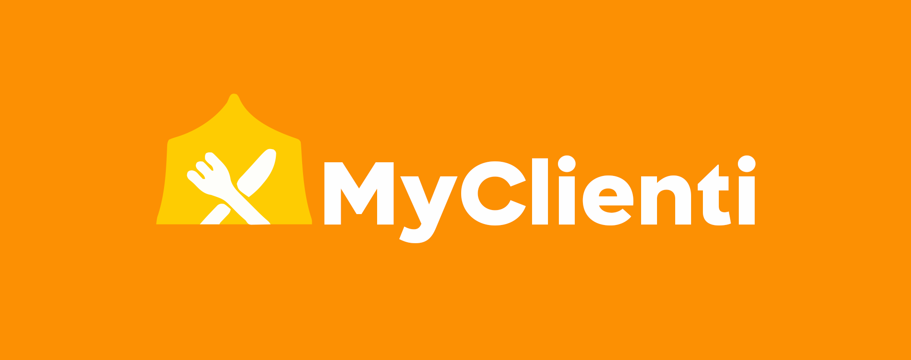

<div align="center">

<p align="center">
  
</p>


# MyClienti 🍕

[](https://github.com/mysagra/myclienti/actions/workflows/publish.yml)
[](https://www.gnu.org/licenses/gpl-3.0)
[](https://nextjs.org/)
[](https://www.typescriptlang.org/)
</div>

A modern and responsive web application for customer order management during festivals and events. Built with Next.js 16 and React 19, it provides a seamless user experience for menu browsing, cart management, and order submission.

## ✨ Features

- 🍽️ **Interactive Menu** - Browse categories with images and product details
- 🛒 **Dynamic Cart** - Real-time order management with side drawer
- 📱 **Responsive Design** - Optimized for both mobile and desktop devices
- 🎨 **Modern UI** - Clean interface with TailwindCSS and Radix UI
- 🔄 **Real-time Updates** - State synchronization with React Query
- ✅ **Validation** - Forms and data validated with Zod and React Hook Form
- 🐳 **Docker Ready** - Simplified deployment with Docker and Docker Compose

## 🚀 Prerequisites

- **Node.js** 20.x or higher
- **pnpm** 9.x or higher (recommended) or npm/yarn
- **Docker** and **Docker Compose** (optional, for containerized deployment)

## 📦 Installation

### Local Installation

1. **Clone the repository**
   ```bash
   git clone https://github.com/mysagra/myclienti.git
   cd myclienti
   ```

2. **Install dependencies**
   ```bash
   pnpm install
   ```

3. **Configure environment variables**
   ```bash
   cp .env.template .env.local
   ```
   
   Edit `.env.local` with your values:
   ```env
   MYSAGRA_API_URL=https://your-api-url.com
   ```

4. **Start the development server**
   ```bash
   pnpm dev
   ```

5. **Open your browser** at [http://localhost:3000](http://localhost:3000)

### Docker Installation

1. **Clone the repository** (if you haven't already)
   ```bash
   git clone https://github.com/mysagra/myclienti.git
   cd myclienti
   ```

2. **Configure environment variables**
   
   Create a `.env` file in the project root:
   ```env
   MYSAGRA_API_URL=https://your-api-url.com
   ```

3. **Start with Docker Compose**
   ```bash
   docker compose up -d
   ```

4. **Access the application** at [http://localhost:3030](http://localhost:3030)

## ⚙️ Configuration

### Environment Variables

| Variable | Description | Required | Default |
|----------|-------------|----------|---------|
| `MYSAGRA_API_URL` | MySagra API backend URL | Yes | - |
| `NODE_ENV` | Runtime environment | No | `production` |

### Production Build

```bash
# Local build
pnpm build
pnpm start

# Docker build
docker build -t mysagra-customer-app .
docker run -p 3000:3000 -e MYSAGRA_API_URL=https://api.example.com mysagra-customer-app
```

## 🛠️ Tech Stack

### Core
- **[Next.js 16](https://nextjs.org/)** - React framework with App Router
- **[React 19](https://react.dev/)** - UI library
- **[TypeScript](https://www.typescriptlang.org/)** - Type safety

### UI & Styling
- **[TailwindCSS 4](https://tailwindcss.com/)** - Utility-first CSS framework
- **[Radix UI](https://www.radix-ui.com/)** - Accessible headless components
- **[Lucide React](https://lucide.dev/)** - Modern icons
- **[Vaul](https://vaul.emilkowal.ski/)** - Drawer components
- **[Sonner](https://sonner.emilkowal.ski/)** - Toast notifications

### State Management & Data Fetching
- **[TanStack Query](https://tanstack.com/query/)** - Server state management
- **React Context** - Client state management

### Form & Validation
- **[React Hook Form](https://react-hook-form.com/)** - Form management
- **[Zod](https://zod.dev/)** - Schema validation

### DevOps
- **[Docker](https://www.docker.com/)** - Containerization
- **[GitHub Actions](https://github.com/features/actions)** - CI/CD
- **[GitHub Container Registry](https://ghcr.io)** - Docker image hosting

## 📁 Project Structure

```
myclienti/
├── app/                      # Next.js App Router
│   ├── (login)/             # Login route group
│   ├── api/                 # API Routes
│   │   ├── orders/          # Order management
│   │   └── proxy/uploads/   # Image proxy
│   ├── cart/                # Cart page
│   ├── confirmation/        # Order confirmation
│   ├── menu/                # Menu and categories
│   └── layout.tsx           # Root layout
├── components/              # Reusable React components
│   └── ui/                  # Base UI components
├── context/                 # React Context providers
├── schemas/                 # Zod validation schemas
├── services/                # API services
├── lib/                     # Utility functions
└── public/                  # Static assets
```

## 🔧 Available Commands

```bash
# Development
pnpm dev          # Start dev server
pnpm build        # Build for production
pnpm start        # Start production server
pnpm lint         # Lint with ESLint

# Docker
docker compose up -d              # Start containers
docker compose down               # Stop containers
docker compose up -d --build      # Rebuild and start
docker compose logs -f myclienti  # View logs
```

## 🚢 Deployment

### GitHub Container Registry

The project is configured with GitHub Actions for automatic deployment to GitHub Container Registry on every release.

1. **Configure the secret** `MYSAGRA_API_URL` in repository settings
2. **Create a release** to trigger the automatic build
3. **Pull the image**:
   ```bash
   docker pull ghcr.io/mysagra/mysagra-myclienti:latest
   ```

### Manual Deployment

```bash
# Login to GHCR
echo $GITHUB_TOKEN | docker login ghcr.io -u USERNAME --password-stdin

# Build and push
docker build -t ghcr.io/mysagra/mysagra-myclienti:latest .
docker push ghcr.io/mysagra/mysagra-myclienti:latest
```

## 🤝 Contributing

Contributions are welcome! Follow these steps:

1. Fork the project
2. Create a branch for your feature (`git checkout -b feature/AmazingFeature`)
3. Commit your changes (`git commit -m 'Add some AmazingFeature'`)
4. Push to the branch (`git push origin feature/AmazingFeature`)
5. Open a Pull Request

## 📄 License

This project is released under the **GNU General Public License v3.0**. See the [LICENSE](LICENSE) file for more details.

## 📧 Contact

For questions, suggestions, or support, open an [issue](https://github.com/mysagra/myclienti/issues) on GitHub.

---

Developed with ❤️ for MySagra
